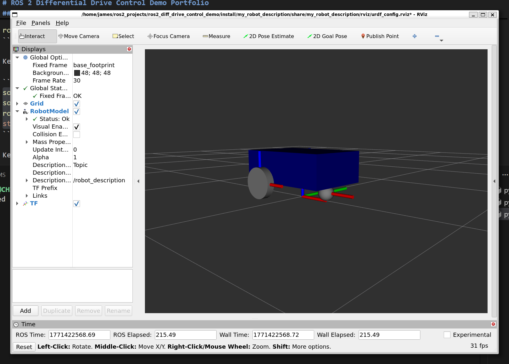
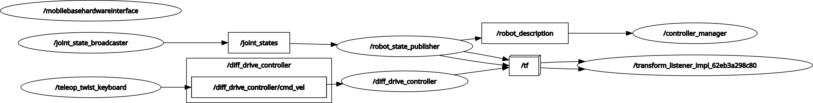
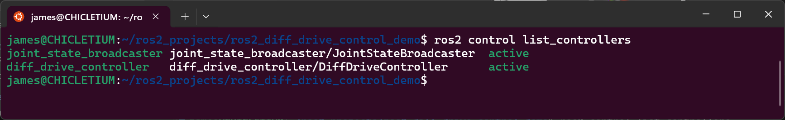
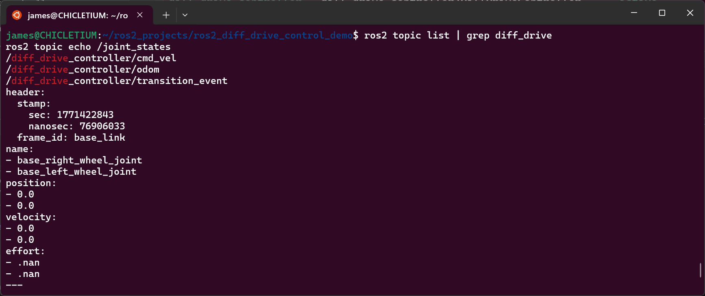
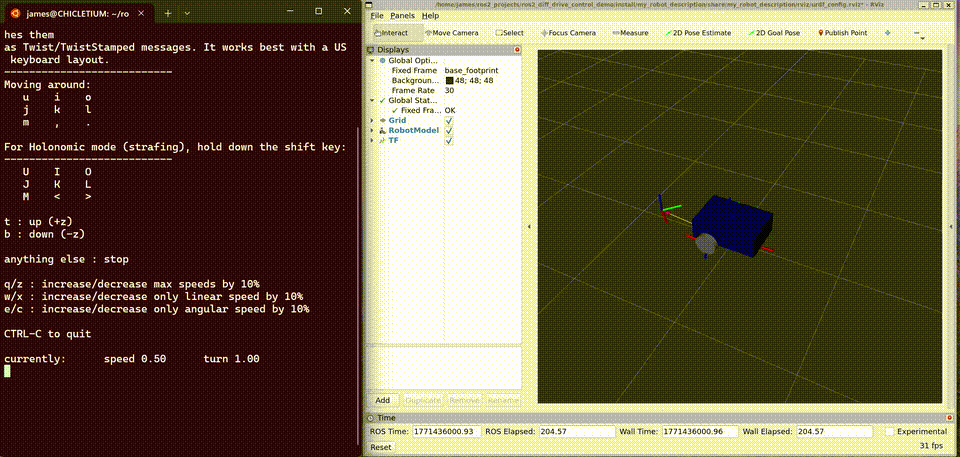
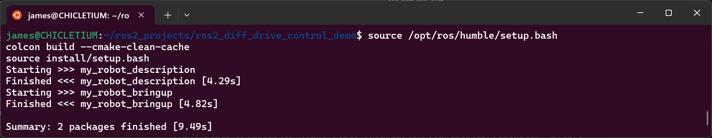

# ROS 2 Differential Drive Control Demo Portfolio

## Title
ROS 2 Differential Drive Robot: From URDF Modeling to `ros2_control` Bringup



## Problem Statement
The goal of this demo is to build a complete but minimal ROS 2 pipeline for a differential-drive mobile robot that can:
- Represent robot geometry and kinematics with URDF/Xacro.
- Publish consistent TF and joint states.
- Run `ros2_control` with a differential drive controller.
- Visualize behavior in RViz2.

The main engineering challenge is ensuring that description, control, and visualization all use the same robot definition and frame conventions so the system behaves coherently.


## System Architecture
The workspace is split into two packages:
- `my_robot_description`: Robot model (`urdf/*.xacro`), RViz config, and display launch.
- `my_robot_bringup`: Controller YAML and full bringup launch for control + visualization.

Runtime architecture in full bringup:
1. Xacro expands `my_robot.urdf.xacro`.
2. `robot_state_publisher` publishes TF from `robot_description`.
3. `ros2_control_node` loads the same `robot_description` and controller config.
4. `joint_state_broadcaster` publishes `/joint_states`.
5. `diff_drive_controller` commands wheel joints and publishes odometry/TF.
6. RViz2 visualizes robot and transforms.
7. `teleop_twist_keyboard` publishes stamped velocity commands to `/diff_drive_controller/cmd_vel` (invoked with `ros2 run` for reliable keyboard stdin handling).



## Technical Implementation
### Software Stack
- ROS 2 Jazzy
- `ament_cmake` + `colcon`
- `xacro`, `robot_state_publisher`, `joint_state_publisher_gui`, `rviz2`
- `controller_manager`, `ros2_control`, `ros2_controllers`
- `diff_drive_controller`, `joint_state_broadcaster`
- `teleop_twist_keyboard`
- Mock hardware plugin: `mock_components/GenericSystem`

### Core Engineering Decisions
- Xacro modularization:
  - `my_robot.urdf.xacro` composes smaller files (`common_properties`, base model, `ros2_control` block) for maintainability.
- Single source of truth for robot description:
  - `robot_state_publisher` receives `robot_description` from the same Xacro command in `my_robot.launch.xml`, reducing TF/control mismatches.
- Control interfaces chosen per wheel joint:
  - Command interface: velocity.
  - State interfaces: position and velocity.
  - This matches diff-drive control needs while keeping the demo simple.
- Realistic frame and odometry setup:
  - `base_frame_id: base_footprint`, `odom_frame_id: odom`, and `enable_odom_tf: true`.
- Fast simulation feedback:
  - Controller and manager update rates configured at 50 Hz for smooth visualization/testing.
- Explicit teleop command routing:
  - Teleop command remaps `/cmd_vel` to `/diff_drive_controller/cmd_vel` and enables stamped Twist messages (`stamped:=true`).

## Key Challenges and Solutions
- Challenge: Controllers loading but no useful wheel state feedback.
  - Solution: Explicitly define wheel joint command/state interfaces in `mobile_base.ros2_control.xacro`.
- Challenge: Differing naming conventions causing silent mismatches.
  - Solution: Keep wheel joint names consistent across URDF and controller YAML (`base_left_wheel_joint`, `base_right_wheel_joint`).
- Challenge: Debugging startup and controller activation sequence.
  - Solution: Use dedicated spawner nodes for `joint_state_broadcaster` and `diff_drive_controller` in launch.

## Results
The demo delivers a working end-to-end ROS 2 control pipeline where:
- The robot model loads correctly in RViz2.
- Joint states are published and consumed.
- Differential drive controller is spawned and active.
- Odometry TF publication is enabled and aligned with configured frames.
- Keyboard teleoperation can command the controller through the remapped velocity topic.

Useful runtime checks:
- `ros2 control list_controllers`
- `ros2 topic echo /joint_states`
- `ros2 topic list | grep diff_drive`




## Reproducibility
Environment used for development/testing:
- WSL2 (Ubuntu + ROS 2 Jazzy)

From workspace root:

```bash
source /opt/ros/jazzy/setup.bash
colcon build
source install/setup.bash
```

Description-only visualization:

```bash
ros2 launch my_robot_description display.launch.xml
```

Full bringup with control:

```bash
ros2 launch my_robot_bringup my_robot.launch.xml
```

Keyboard teleoperation (new terminal):

```bash
source /opt/ros/jazzy/setup.bash
source install/setup.bash
ros2 run teleop_twist_keyboard teleop_twist_keyboard --ros-args -r /cmd_vel:=/diff_drive_controller/cmd_vel -p stamped:=true
```



Key files for replication:
- `src/my_robot_description/urdf/my_robot.urdf.xacro`
- `src/my_robot_description/urdf/mobile_base.xacro`
- `src/my_robot_description/urdf/mobile_base.ros2_control.xacro`
- `src/my_robot_bringup/config/my_robot_controllers.yaml`
- `src/my_robot_bringup/launch/my_robot.launch.xml`



## What to Improve
- Replace placeholder metadata in `package.xml` (description/license/versioning discipline).
- Add real hardware interface (or Gazebo/Ignition plugin) instead of mock system for higher-fidelity behavior.
- Add automated validation:
  - Launch tests to verify controller states and TF availability.
  - CI checks for Xacro/URDF consistency.
- Add teleoperation + trajectory tests (`cmd_vel` workflows and controller performance metrics).
- Improve documentation with finalized architecture diagrams and benchmark plots (latency, odom drift, controller stability).
